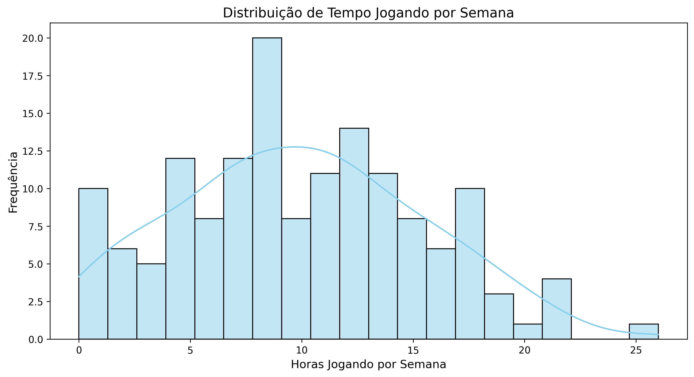
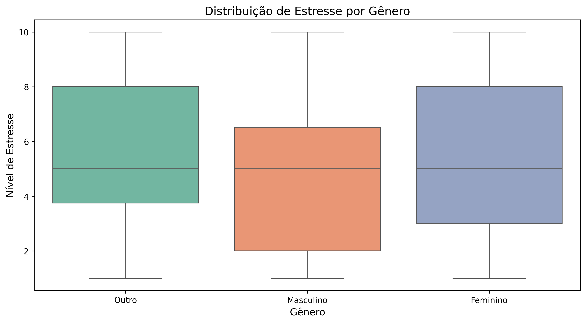
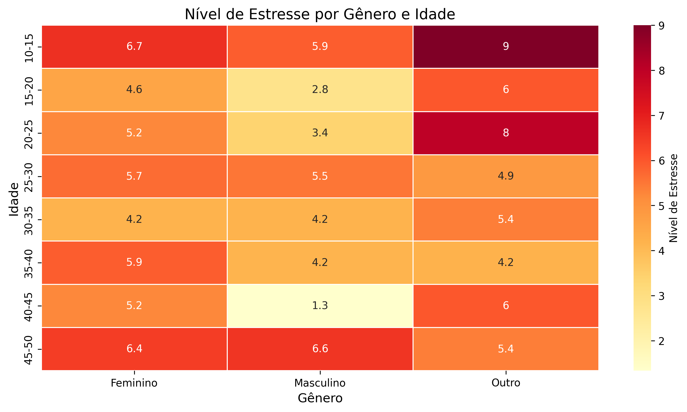

# Análise da Relação entre Jogos Eletrônicos e Saúde Mental

## 📁 Project Structure

```plaintext
.
├── cp_1/                  # Main analysis directory
│   ├── main.py            # Python script version
│   ├── main.ipynb         # Jupyter Notebook version
│   ├── graphs/            # Generated visualizations
│   │   ├── histograma_horas_jogando.png
│   │   ├── boxplot_estresse_genero.png
│   │   └── ... (30+ image files)
│   ├── data/              # Dataset files
│   │   └── games_mental_health.csv
│   └── proposta/          # Project proposal documents
│       ├── proposta.pdf
│       └── apresentacao.pptx
│
└── html/                  # Web presentation files
    ├── imgs/              # Website images
    │   ├── banner.jpg
    │   └── favicon.ico
    └── index.html         # Main website file
```

## 📌 Visão Geral do Projeto

Este projeto analisa a relação entre o tempo gasto com jogos eletrônicos e os níveis de estresse em diferentes grupos demográficos. Utilizando dados de 150 participantes, exploramos:

- Padrões de horas jogadas por semana
- Distribuição de níveis de estresse
- Diferenças por gênero e faixa etária
- Correlação entre tempo de jogo e estresse

## 🎯 Principais Descobertas

1. **Correlação insignificante** (0.05) entre horas jogadas e estresse
2. **Diferenças marcantes por gênero**:
   - Grupo "Outro": maior tempo médio (10.2h/semana) e estresse (5.67)
   - Homens: menor estresse (4.47) mesmo jogando 9.3h/semana
3. **Distribuição etária equilibrada** (13-49 anos)

## 📊 Visualizações Principais

| Gráfico | Descrição | Link |
|---------|-----------|------|
|  | Distribuição de horas jogadas | [Ver gráfico](cp_1/graphs/histograma_horas_jogando.png) |
|  | Estresse por gênero | [Ver gráfico](cp_1/graphs/boxplot_estresse_genero.png) |
|  | Estresse por gênero e idade | [Ver gráfico](cp_1/graphs/heatmap_estresse_genero_idade.png) |

## 🌍 Links Úteis

[](https://cp1-data-science-557111-daniel.netlify.app/)
[](https://faithful-industry-226.notion.site/CP-01-data_science_for_engineering-13d7580aaa6a8071a495f35dffbc7193)
[](https://github.com/DanielMTorres7/cp1_data_science)

- [🌐 Live Demo](https://cp1-data-science-557111-daniel.netlify.app/)
- [📚 Technical Documentation](https://faithful-industry-226.notion.site/CP-01-data_science_for_engineering-13d7580aaa6a8071a495f35dffbc7193)
- [💻 Source Code](https://github.com/DanielMTorres7/cp1_data_science)

## 🛠️ Como Executar

### Pré-requisitos
- Python 3.8+
- Bibliotecas: pandas, seaborn, matplotlib, numpy

### Instalação
```bash
git clone https://github.com/DanielMTorres7/cp1_data_science.git
cd cp1_data_science
pip install -r requirements.txt
```
